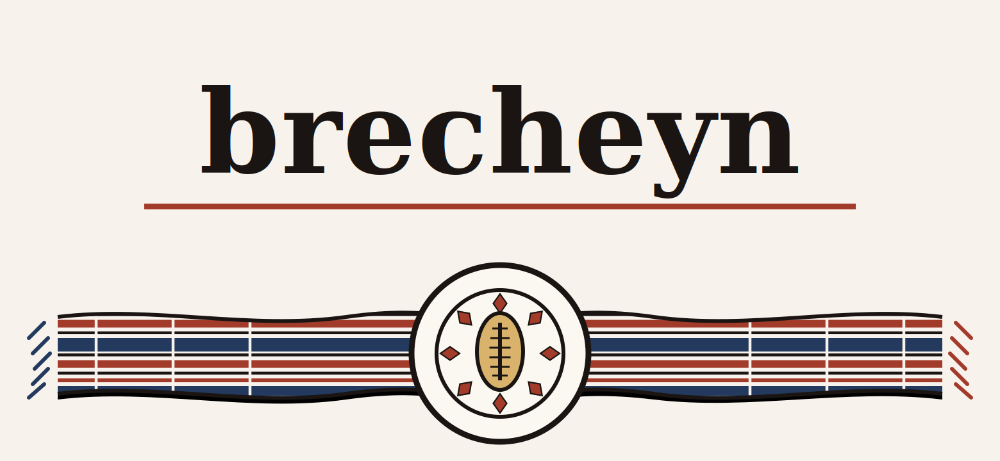

  

  
  
  

<h3 align="center">About</h3>

<table>
<tr>
<td width="30%" align="center">
  
</td>
<td width="70%">

Full-stack developer and IoT/AI engineer based in Ouagadougou, Burkina Faso. Grew up in Fada N'Gourma speaking Gourmantchéma and Mooré before French — a background that shaped a habit of working across systems that don't naturally speak the same language.

Comfortable across the stack, from embedded systems and IoT to backend architecture and applied AI, with a growing focus on cybersecurity and network analysis.

</td>
</tr>
</table>

<h3 align="center">Compétences</h3>

<table>
<tr>
<td width="50%">

**Frontend**

| | |
|---|---|
| Flutter & Dart (Expert) |  |
| Architecture Offline-First (SyncQueue) |  |
| Material 3 & Design System |  |
| Angular / React / Vue.js |  |
| TypeScript / JavaScript |  |
| HTML5 / CSS3 (SASS/Tailwind) |  |

</td>
<td width="50%">

**Outils**

| | |
|---|---|
| Git / GitHub / CI-CD |  |
| Docker & Conteneurisation |  |
| IoT (PlatformIO / ESP32 / Arduino) |  |
| Analyste Cybersécurité & Réseaux |  |
| Figma & Design UI/UX |  |
| Modélisation 3D |  |

</td>
</tr>
</table>

<table>
<tr>
<td width="60%">

**Base de données**

| | |
|---|---|
| SQL (PostgreSQL / SQLite / MySQL) |  |
| Modélisation Merise / UML |  |
| MongoDB (NoSQL) |  |
| Modélisation de données relationnelles |  |

</td>
<td width="40%" align="center">

**Aussi à l'aise avec**

</td>
</tr>
</table>

<h3 align="center">Stats</h3>

  
  

  

<h3 align="center">Contact</h3>

  
  
  

